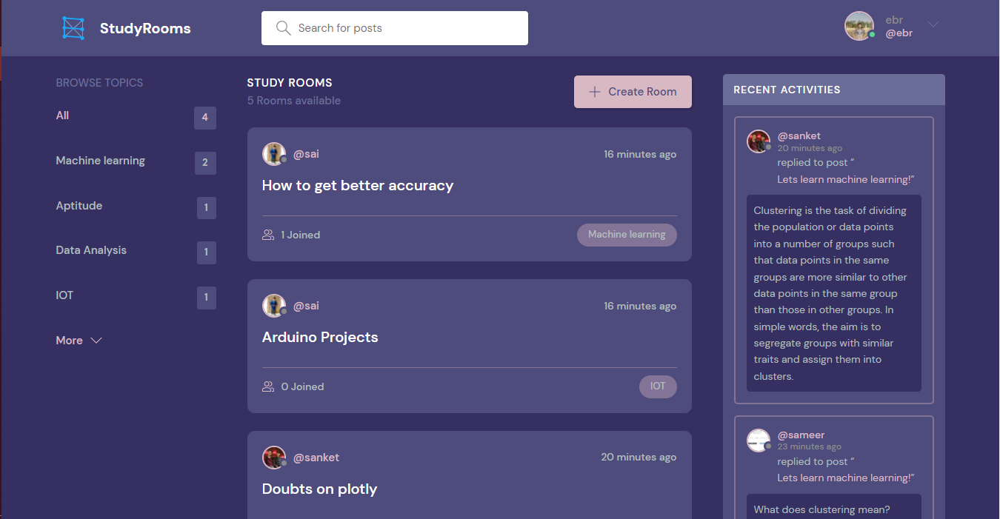
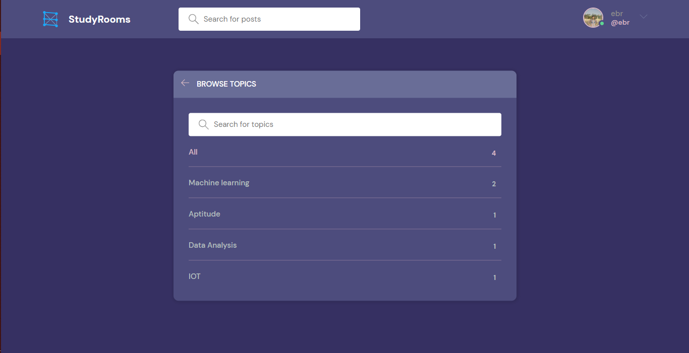
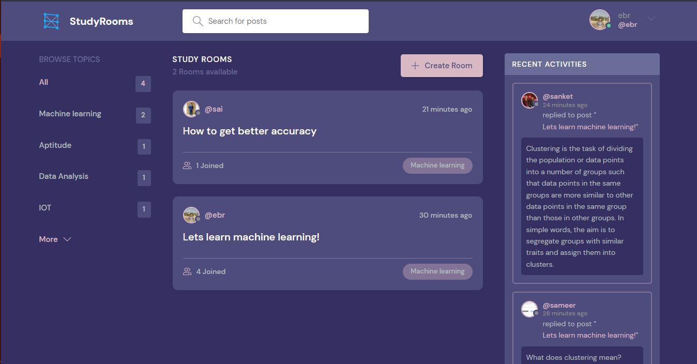
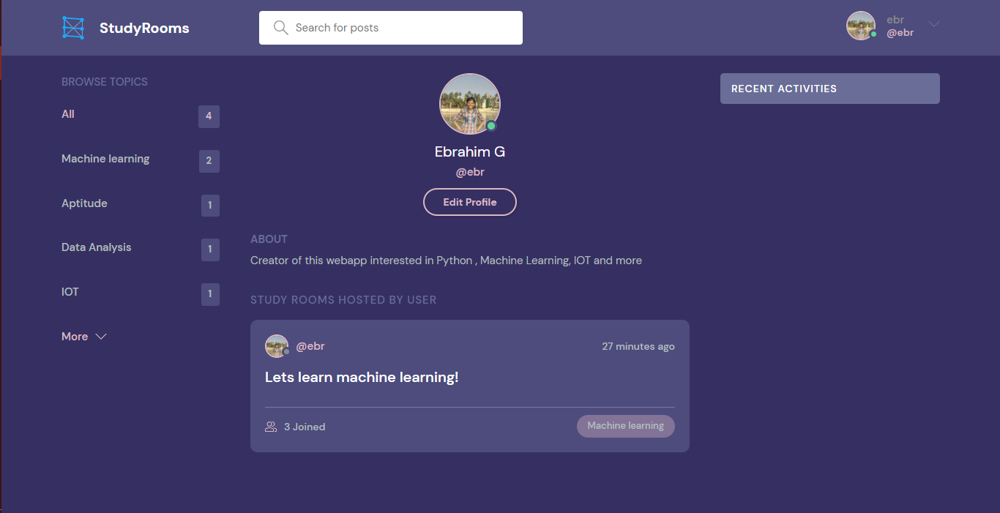
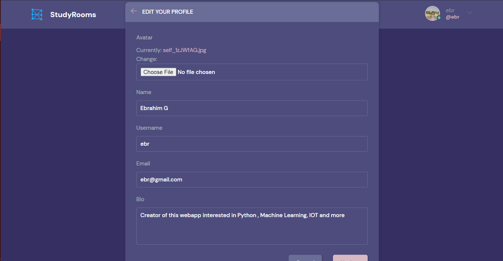
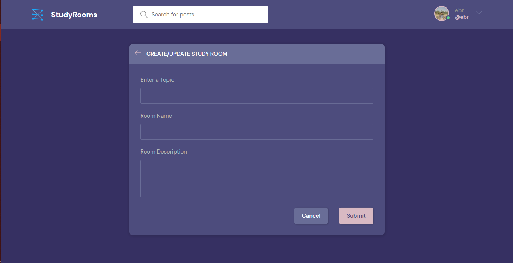
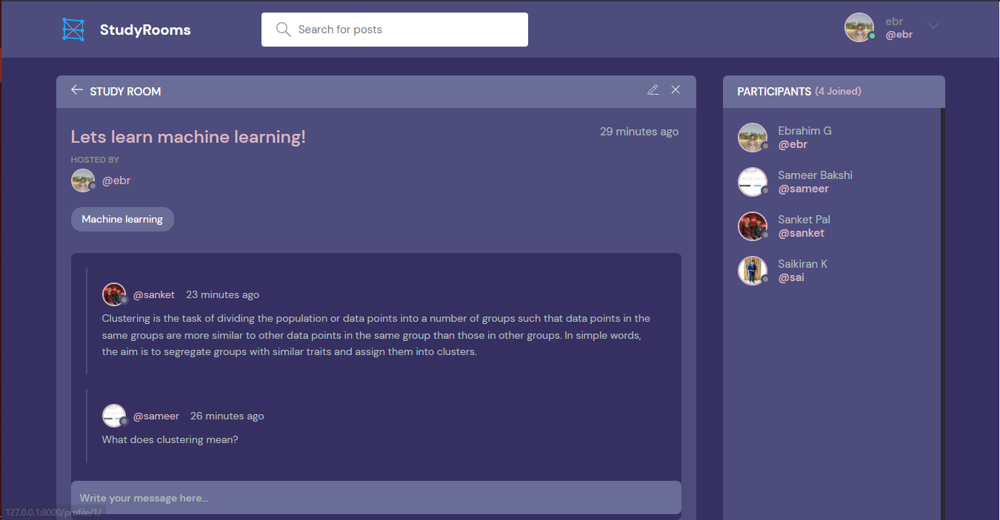

<h1 align='center'>StudyRooms<h1>
<h3>StudyRooms are rooms where people around the world can join in and discuss about the topics and also solve each others doubts.</h3>

Technologies used: Django ,HTML ,CSS , JS ,Django REST Api

  <h2>Preview</h2>
  <h4>Home page</h4>
  
Home page has the features of searching rooms or topics , Viewing all the existing rooms and Recent activities in differnt rooms.

  
  

  <h4>Browse Topics Page</h4>
  
  

  <h4>Browse Results Page</h4>
  
Browsing according to the wanted topics eg <b>Machine Learning</b>

  
  

  <h4>Profile Page</h4>
  
  

  <h4>Edit profile Page</h4>
  
  

  <h4>Create Room Page</h4>
  
  

  <h4>Room</h4>
  
This is where you can join the room and discuss or chat on any topics related to the room.

  
  

